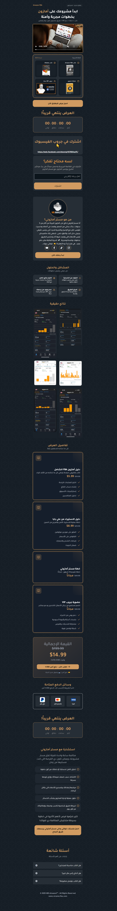

---

# MR Amazoni Sales Funnel

Production Case Study

High-converting Arabic sales funnel system designed for Amazon FBA entrepreneurs, focused on conversion optimization, offer presentation, lead generation, and customer engagement.

---

## 📑 Table of Contents

- [🚀 Project Overview](#-project-overview)
- [✨ Key Features](#-key-features)
- [🧠 Funnel Conversion Strategy](#-funnel-conversion-strategy)
- [🎨 UI/UX Direction](#-uiux-direction)
- [📱 Mobile-First Experience](#-mobile-first-experience)
- [🧳 Technologies](#-technologies)
- [📸 Screenshots](#-screenshots)
- [🌍 Live Website](#-live-website)
- [📌 Project Information](#-project-information)
- [📈 Project Impact](#-project-impact)
- [🔒 Source Code](#-source-code)
- [📬 Contact Information](#-contact-information)

---

## 🚀 Project Overview

MR Amazoni is a high-conversion Arabic sales funnel system developed for Amazon FBA entrepreneurs and digital product audiences.

The project was designed to maximize conversions by combining strong visual hierarchy, psychological marketing triggers, structured offer presentation, and conversion-focused user experience strategies.

The funnel guides visitors through multiple stages including awareness, trust-building, social proof, pricing psychology, urgency, and final call-to-action conversion.

The entire experience was optimized for mobile users and built using Systeme.io with integrated marketing tracking and analytics tools.

---

## ✨ Key Features

- High-converting sales funnel structure
- Video-first hero section
- Mobile-first responsive experience
- Luxury-inspired dark UI with gold accents
- Countdown timer for urgency creation
- Customer testimonials and proof sections
- Pricing psychology implementation
- Optimized CTA placement strategy
- FAQ objection handling section
- Community-building integration
- Consultation & engagement sections
- Smooth scrolling experience
- Conversion-focused content hierarchy
- Facebook Pixel integration
- Microsoft Clarity integration
- Funnel analytics & user behavior tracking

---

## 🧠 Funnel Conversion Strategy

### 🎯 Attention Layer

- Strong value proposition headline
- Video-first hero section
- Visually engaging luxury-inspired design
- Emotional targeting for entrepreneurs

### 🔥 Engagement Layer

- Trust-building content structure
- Author credibility presentation
- Interactive visual sections
- Social proof & success metrics
- Community invitation sections

### 💰 Conversion Layer

- Strategic offer stacking
- Pricing comparison structure
- Countdown urgency system
- Multi-step CTA placement
- Conversion-oriented section hierarchy

### 📈 Retention Layer

- Facebook community integration
- Consultation funnel integration
- User engagement optimization
- Follow-up communication strategy

---

## 🎨 UI/UX Direction

The interface was designed using a premium dark theme combined with gold accents to create a luxury brand perception and increase user trust.

The visual hierarchy focuses heavily on:

- Conversion-oriented layouts
- CTA visibility and positioning
- Psychological marketing triggers
- Content readability
- Mobile-first usability
- Smooth section transitions
- Visual consistency across the funnel

---

## 📱 Mobile-First Experience

The funnel was primarily designed and optimized for mobile users to ensure:

- Fast navigation flow
- Smooth scrolling experience
- High readability on small screens
- Clear CTA visibility
- Better conversion behavior across mobile devices

The project structure prioritizes mobile engagement before desktop adaptation.

---

## 🧳 Technologies

- Systeme.io
- HTML5
- CSS3
- JavaScript
- Tailwind CSS
- Facebook Pixel
- Microsoft Clarity
- Funnel Analytics Tools

---

## 📸 Screenshots

### Full Funnel View

---

## 🌍 Live Website

https://www.mramz-fba.com

👉 View full case study on my website:  
https://mahmoudabuyoussef.com/projects/mr-amazoni

---

## 📌 Project Information

| Field        | Details                                   |
| ------------ | ----------------------------------------- |
| Project Type | Sales Funnel System                       |
| Industry     | Marketing / Amazon FBA                    |
| Role         | Front-End Developer                       |
| Platform     | Systeme.io                                |
| Focus        | Conversion Optimization & Lead Generation |
| Duration     | 1 Day                                     |
| Status       | Production                                |
| Year         | 2025                                      |

---

## 📈 Project Impact

- Increased conversion opportunities through structured funnel flow
- Improved engagement using mobile-first UX strategies
- Enhanced trust using premium visual branding
- Reduced bounce rate through video-first experience
- Optimized CTA visibility and click-through behavior
- Improved marketing analytics tracking and user behavior insights
- Created scalable structure for future marketing campaigns

---

## 🔒 Source Code

This project was developed for a real production environment.

The source code is private and not publicly available due to client and production restrictions.

This repository is intended for project presentation and case study purposes only.

---

## 📬 Contact Information

If you'd like to collaborate, discuss a project, or hire me for development work:

- 📧 Email: contact@mahmoudabuyoussef.com
- 💼 LinkedIn: https://www.linkedin.com/in/mahmoudabuyoussef
- 🌐 website: https://mahmoudabuyoussef.com
- 🐙 GitHub: https://github.com/mahmoud-abuyoussef
